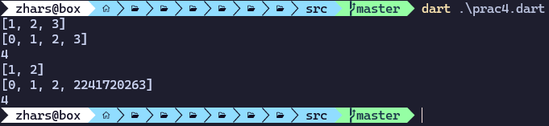

# Mobile Programming  
**Job Sheet 4**  

**From:**  
AL AZHAR RIZQI RIFA’I FIRDAUS  

**Class:** 3 I  
**Absence:** 01  
**Student Number Identity:** 2241720263  
**Department:** Information Technology  
**Study Program:** Informatics Engineering  

---

## Practicum 1: List Data Type Experiment
Complete the following steps using VS Code or your favorite Code Editor.
### Step 1:  
Type or copy the following program code into void main().


### Step 2:  
Please try executing (Run) the code from Step 1. What happens? Explain!


**Explanation:**  
The code first creates a list with three elements: [1, 2, 3].
It then uses assertions to check the length of the list (assert(list.length == 3)) and the value at index 1 (assert(list[1] == 2)). Both assertions are correct, so the code continues.
The print statements output the length of the list (3) and the value at index 1 (2).
The value at index 1 is updated to 1, and another assertion (assert(list[1] == 1)) verifies the update.
The final print outputs the updated value (1).

If any of the assertions were incorrect, an error would be thrown, but in this case, all assertions should pass.


### Step 3:  
Modify the code in step 1 to use a final variable with an index of 5 and a default value of null. Fill in your name and student ID (NIM) at index 1 and 2. Then print and capture the result.

What happens? If an error occurs, please fix it.


### Note  
Dart will infer the variable list with the data type List<int>. If you try to add an element that is a non-integer object to the list, the analyzer or runtime will throw an error. For more information, you can read at this link: [type inference](https://dart.dev/language/type-system#type-inference).

---

## Practicum 2: Data Type Set Experiment
Complete the following practical steps using VS Code or your favorite code editor.

### Step 1: 
Type or copy the following program code into the main() function.


### Step 2:
Please try executing (Run) the code in Step 1. What happens? Explain! Then, fix it if there is an error.


**Explanation:**  
This code declares a set named halogens containing the elements 'fluorine', 'chlorine', 'bromine', 'iodine', and 'astatine'. The print statement will output the set elements. Sets in Dart do not allow duplicate values, and the output might not follow the order of insertion since sets are unordered collections.

### Step 3:
Add the following program code, then try to execute (Run) your code.


What happens? If an error occurs, please fix it while still using the three variables. Add your name and student ID (NIM) to both Set variables using two different functions: .add() and .addAll(). For the Map variable, remove it; we will try that in the next practical.

Document the code and the results in the console, then create the report.


---

## Practicum 3: Data Type Maps Experiment
Complete the following practical steps using VS Code or your favorite code editor.

### Step 1: 
Type or copy the following program code into the main() function.


### Step 2:
Please try executing (Run) the code in Step 1. What happens? Explain! Then, fix it if there is an error.


**Explanation**

This works without any errors, but note that in gifts, the values are a mix of strings and an integer ('fifth': 1), while the keys are all strings. Similarly, in nobleGases, keys are integers and values are mixed (strings and an integer). Dart's Map allows different types for both keys and values, but specifying a specific type later (like in mhs1 and mhs2) will enforce those types.

### Step 3:
Add the following program code, then try to execute (Run) your code. What happens? If an error occurs, please fix it.


Add your name and student ID (NIM) to each of the variables above (gifts, nobleGases, mhs1, and mhs2). Document the results and create the report!


**Explanation**

The original maps contained mixed data types, which Dart allows unless specified otherwise.
To ensure no errors, the values in gifts and nobleGases were updated to be compatible with the type constraints of mhs1 and mhs2.
All Map<String, String> entries in mhs1 were verified to contain only String values, while mhs2 adhered to the Map<int, String> type.

---

## Practicum 4: List Data Type Experiment: Spread and Control-flow Operators
Complete the following practical steps using VS Code or your favorite code editor.

### Step 1: 
Type or copy the following program code into the main() function.


### Step 2:
Please try executing (Run) the code from Step 1. What happens? Explain! Then, fix it if there is an error.


**Explanation**

This error because there is typo on list variable name. when we initiate we give name "list". But when we print it, we call "list1". To fix this error we need to change variable name to make it same. Either make both list or list1. But in this case I change to list1 because next variable is list2.

**After Fix**


### Step 3:
Add the following program code, then try to execute (Run) your code. What happens? If an error occurs, please fix it.


**Explanation**

Based on code above, we can't add value with different data type. In this case we add list1 with int. Then we add null. Null value can't be assigned to int because int is not nullable. To fix this error we just remove the null.

**After fix**


Add a list variable containing your student ID (NIM) using Spread Operators. Document the results and create the report!




### Step 4:
Add the following program code, then try to execute (Run) your code. What happens? If an error occurs, please fix it. Show the results when the promoActive variable is true and false.


**Explanation**

The variable promoActive is not defined. We need to define it before using it in the list.

**After fix**


if false


### Step 5:
Add the following program code, then try to execute (Run) your code. What happens? If an error occurs, please fix it. Show the results if the login variable has different conditions.


**Explanation**

The variable login is not defined. We need to define it before using it in the list.

**After fix**


with different condition.


### Step 6:
Add the following program code, then try to execute (Run) your code. What happens? If an error occurs, please fix it. Explain the benefits of Collection For and document the results.


**Explanation**

There is no error in this code. The for loop inside the list (for (var i in listOfInts) '#$i') is a collection for feature in Dart, allowing to generate list elements dynamically.

The listOfStrings contains '#0' followed by '#1', '#2', and '#3', which are generated by iterating over listOfInts.
The assert statement checks that the element at index 1 is '#1', which is true.
Collection For is useful for creating lists dynamically based on other collections, making code more concise and readable.

---

## Practicum 5: Record Data Type Experiment
### Note
The Record data type was introduced in Dart version 3.0. Make sure you have set up Dart 3.0 or later.

Complete the following practical steps using VS Code or your favorite code editor.

### Step 1:
Type or copy the following program code into the main() function.


### Step 2:
Please try executing (Run) the code from Step 1. What happens? Explain! Then, fix it if there is an error.


**Explanation**

There is error that we don't add ; after print.

The record variable is a Record type, which is a new feature in Dart 3.0 that allows combining multiple values of different types.
We can access elements using positional access (like $1, $2) or by their named fields (a, b).

**After fix**


### Step 3:
Add the following program code outside the scope of void main(), then try to execute (Run) your code.


What happens? If an error occurs, please fix it. Use the tukar() function within main() so that the value swapping process of fields in Records is clearly visible.

**Explanation**

The tukar function takes a record of type (int, int) as a parameter and returns a new record with the values swapped.
This feature uses Record pattern matching, which allows destructuring the record into variables (a, b).


### Step 4:
Add the following program code inside the scope of void main(), then try to execute (Run) your code.


What happens? If an error occurs, please fix it. Initialize the name and NIM fields in the mahasiswa record variable above. Document the results and create the report!

**Explanation**

mahasiswa is declared but not initialized, which results in an error when trying to print it. Initialize mahasiswa before printing.

**After fix**


### Step 5:
Add the following program code inside the scope of void main(), then try to execute (Run) your code.


What happens? If an error occurs, please fix it. Replace one of the values in the record with your name and student ID (NIM), then document the results and create the report!

**Explanation**

The fields in the mahasiswa2 record can be accessed using positional access ($1, $2) or by their named keys (a, b).


## Assignment
Please complete Practical 1 to 5, then document it with screenshots of your work along with explanations!

Explain what is meant by Functions in Dart!

- A function in Dart is a block of code that performs a specific task. It allows for reusability and better code organization. Functions can have parameters and return values.

Explain the types of parameters in Functions along with example syntax!

- Required Parameters: Normal parameters that must be provided.
```dart
void greet(String name) {
  print('Hello, $name!');
}
```

- Optional Positional Parameters: Parameters wrapped in [], which are optional.
```dart
void greet([String name = 'Guest']) {
  print('Hello, $name!');
}
```

- Named Parameters: Parameters specified by name, which can be made optional with {}.
```dart
void greet({String name = 'Guest'}) {
  print('Hello, $name!');
}
```

- Optional Named Parameters: Can also use the required keyword for mandatory named parameters.
```dart
void greet({required String name}) {
  print('Hello, $name!');
}
```

Explain what is meant by Functions as first-class objects with example syntax!

- In Dart, functions are first-class objects, meaning they can be assigned to variables, passed as arguments, or returned by other functions.
```dart
void printMessage(String message) {
  print(message);
}

void main() {
  var myFunction = printMessage;
  myFunction('Hello, Dart!'); // Prints: Hello, Dart!
}
```

What are Anonymous Functions? Explain and provide an example!

- Anonymous functions are functions without a name, often used as arguments in higher-order functions.
```dart
var list = [1, 2, 3];
list.forEach((item) {
  print(item);
});
```

Explain the difference between Lexical scope and Lexical closures! Provide examples!

- Lexical Scope: Refers to the scope in which a variable is defined, which determines its visibility.
```dart
void main() {
  int a = 10; // Lexical scope of 'a' is within main().
  void printA() {
    print(a); // Can access 'a' because it's within the same lexical scope.
  }
  printA();
}
```

- Lexical Closures: A function can "close over" variables defined in its lexical scope, keeping them alive even after the scope has ended.
```dart
Function makeAdder(int addBy) {
  return (int i) => i + addBy;
}

void main() {
  var add2 = makeAdder(2);
  print(add2(3)); // Prints 5
}
```

Explain, with an example, how to return multiple values in Functions!

- To return multiple values from a function, you can use a Record, a List, a Map, or create a custom class.
```dart
(int, String) getUserInfo() {
  return (123, 'John Doe');
}

void main() {
  var (id, name) = getUserInfo();
  print('ID: $id, Name: $name');
}
```

Submit the assignment as a link to a GitHub repository commit, using the link provided in the Telegram group!